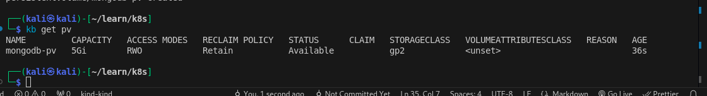
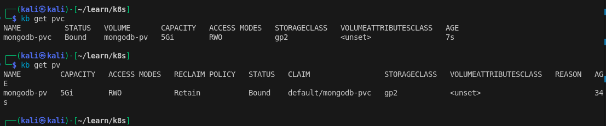
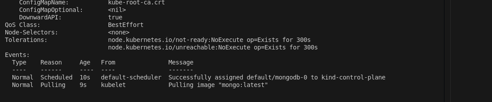
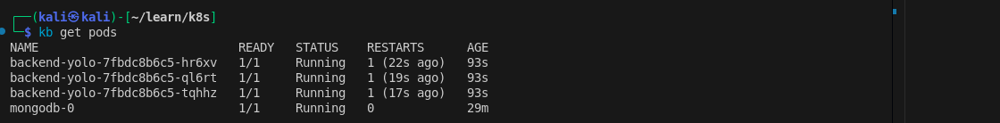
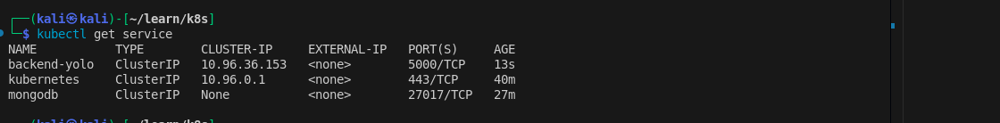
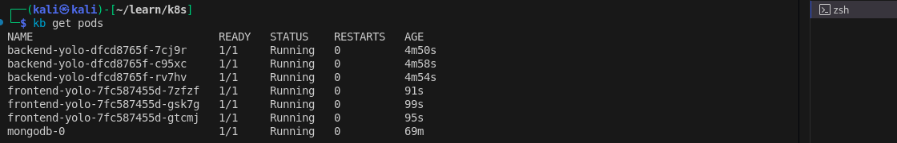

# YOLO ECOMMERCE APPLICATION
## access the application through this ip '52.224.84.242'
### yolomy application: [yolomy-application.com](52.224.84.242)
This application is an e-commerce platform that assists users in selling and buying products. Users can sell their products by logging in and adding product details. Once added, the product will be displayed for customers to view and purchase.

### Product Screenshots
- Adding a Product:
  
  
- Viewing a Product:
  

---

## RUNNING THE APPLICATION IN K8S

The application is configured to run on Kubernetes. After creating a cluster in your cloud provider, we start by creating a persistent volume (PV) so that our database can persist the product details.

### Prerequisites

Before you begin, you need to clone this repository and set up your local environment.

1. First, clone the repository by running the following command:

    ```bash
    git clone https://github.com/rashidjosphat/ip4.git
    ```

    This will clone the repository to your local machine.

2. You will also need `kubectl` for communicating with your Kubernetes cluster. You can find a detailed explanation on how to install it in the [Kubernetes installation guide](https://kubernetes.io/docs/tasks/tools/install-kubectl-windows/).

---

### Creating a Persistent Volume (PV)

In the `mongodb-k8s` folder, there is a file called `mongo-pv.yml`. This file will be used to provision our Persistent Volume (PV).

1. After navigating into the directory containing the YOLO files, apply the PV resource by running:

    ```bash
    kubectl apply -f ./mongodb-k8s/mongo-pv.yml
    ```

2. To verify that the PV was created successfully, run the following command:

    ```bash
    kubectl get pv
    ```

    This will output something like:
    

---

### Creating a Persistent Volume Claim (PVC)

After successfully creating the PV, you need to create the Persistent Volume Claim (PVC) to bind the database to the PV.

1. Apply the PVC resource by running the following command:

    ```bash
    kubectl apply -f ./mongodb-k8s/PVC.yml
    ```

2. To confirm that the PVC is running successfully, use the following commands:

    ```bash
    kubectl get pvc
    kubectl get pv
    ```

    This will output something like:
    

---

### Deploying MongoDB StatefulSet with a Service

After confirming that the PVC is running and successfully bound to the PV, you can now deploy MongoDB and its associated service.

1. Apply the MongoDB StatefulSet and service resource by running the following commands:

    ```bash
    kubectl apply -f ./mongodb-k8s/stateful.yml
    kubectl apply -f ./mongodb-k8s/service.yml
    ```

    This may take some time, depending on the image size, as it needs to pull the `mongo:latest` image as specified in the `stateful.yml` file.

2. To check the status of the pods and ensure there are no errors, run:

    ```bash
    kubectl describe pod mongodb-0
    ```

    Note: While pods have unique names, because we are using a StatefulSet, the pod name will be incremented (i.e., `mongodb-0`, `mongodb-1`, etc.). The `describe` command will output something like:

    

extraNote: you have now move from the finiky part lets now tackle the rest of the resorces 🫣🥲.
---

### Creating the Backend with a Service
1. now to run the backend run .
```bash
    kubectl apply -f ./backend-k8s/deployment.yml
```

    Note: this too is gona take a while you can go and take a cup of tea while you wait 😄.

after it have finished you can comfirm that it is indeed running by running .
```bash
    kubectl get pods
```
you should be able to see backend-yolo-<podid> desplayed like this.




2. now that the backend pod is running you can now run the backend service by running .

```bash
    kubectl apply -f ./backend-k8s/service.yml
```
to confirm that our service is running run .

```bash
    kubctl get service
```
it will output something like this .


now that the backend service is done lets run the front end.

### deploying the frontend with it service
now that we are at the last part 😜 run.
```bash
    kubectl apply -f ./frontend-k8s/deployment.yml 
```

and the service 
```bash
    kubectl apply -f ./frontend-k8s/deployment.yml 
```
confirming is the same as for the backend and will output an almost identical to that of the backend.
if you see this .




thats means you are good to go 🧑‍🦯‍➡️.

# THE AUTOMATION
For the people how feel like typing is taking to much like i , i have a solution for you guys i have created a automation 
python file called automation.py in the main branch .
## how to run it
so for automating the whole process run.
```bash
    python3 automation.py
```
this python file gona do all for you guys

### CONTANT AND COLLABORATION
If you'd like to collaborate, have questions, or just want to get in touch, feel free to reach out to me!

    - 0798190943
    - josphat.rashid@student.moringaschool.com

I'm open to collaboration opportunities, feedback, and general inquiries!
