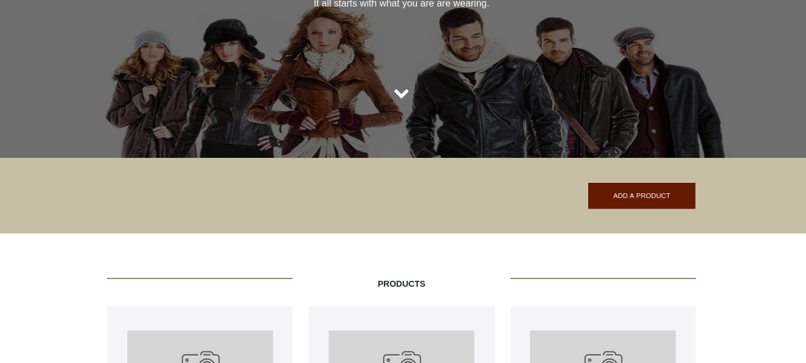
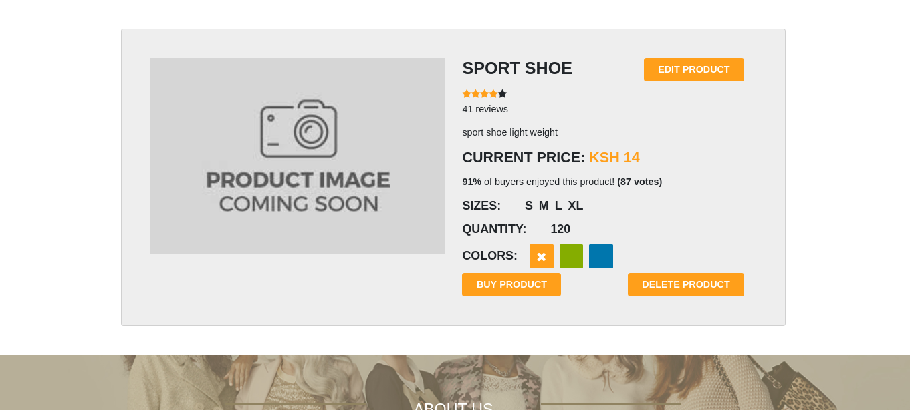

# YOLO ECOMMERCE APPLICATION
this application is an e-commerce application. which assist ussers in selling and buying product, 
user can sell there product by loging in and then add product 
 
, after the product details are 
added the product will be deplayed to customers who can order your product from the application like this .



# RUNNING THE APPLICATION IN K8S
the application is configure in a way it can run on k8s so after creting a cluster in your clowd provider we start by creating a persistent volume so that our database can keep parsist the product details.

## Preriquesites
first of all things we need to have our clone application in you machine so
after creating a derectory where you want to store the application provision files run.
```bash
    git clone https://github.com/rashidjosphat/ip4.git
```
this will clone this repo. 
the other tools you must have before proceeding is kubectl for communicating with your cluster. You can find
detail explanation on how to install it in the [kube install](https://kubernetes.io/docs/tasks/tools/install-kubectl-windows/).

### creating a PV
in the mongodb-k8s folder there is a file called mongo-pv.yml that is what we gona use to provision our PV.
first you need

